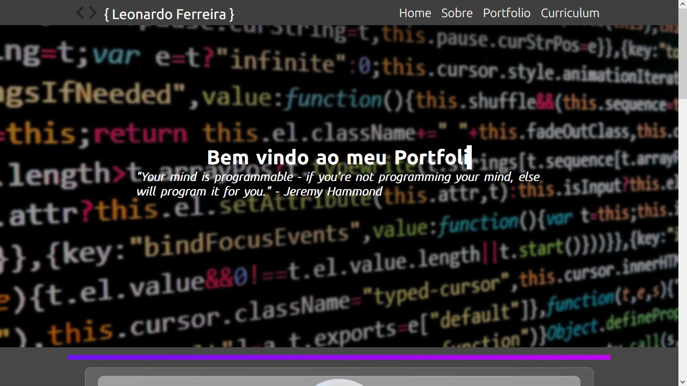
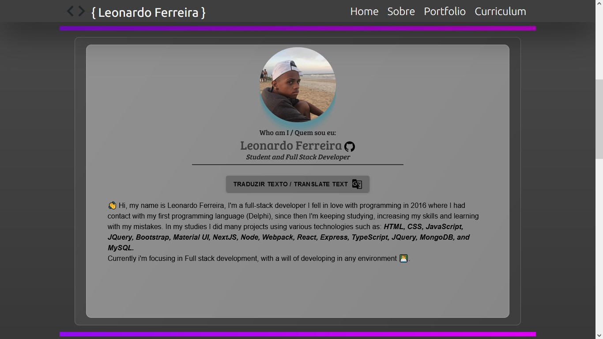
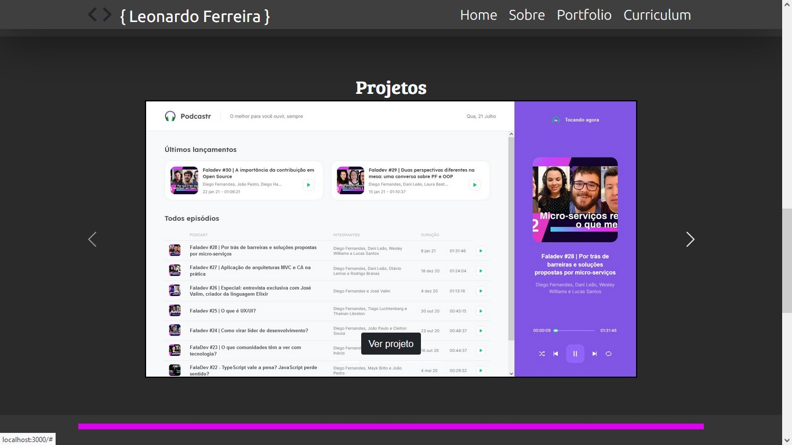
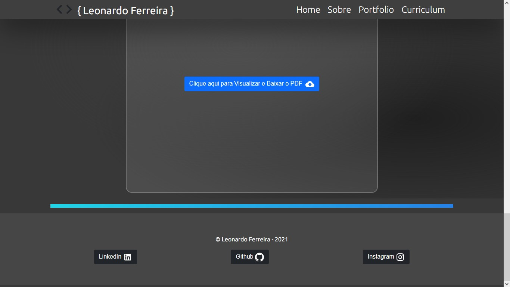

<h1 align="center">Portfolio Leonardo Ferreira

# Screenshots 📸


<br>







# Getting Started

## Install
To run this project first you need to install the dependencies, clone this project and in your terminal type:

``` npm install or yarn ```

## Start

After install the dependencies, type: <br>
``` npm start or yarn start ```
# Technologies
* Typescript
* React
* React Responsive
* React Bootstrap
* React anchor link smooth scroll
* React AOS
* Material UI
* Styled Components
* ESLint
* Prettier
# Developed with 💜 By Leonardo Ferreira
